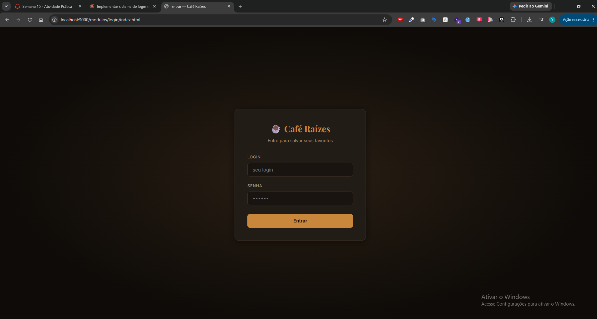
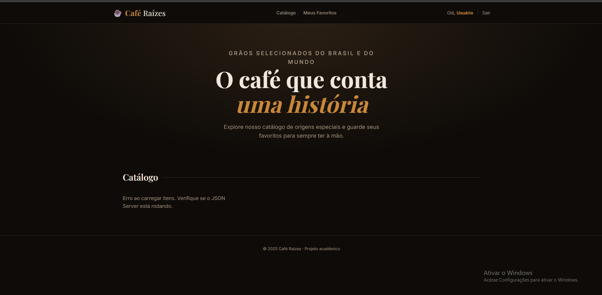
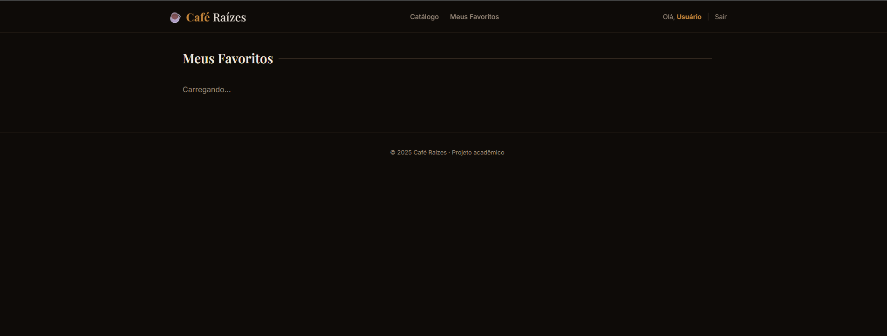

[](https://classroom.github.com/a/_PLVIDG8)

# Trabalho Prático — Semana 15
## Personalização do site com Integração de Login de Usuário

**Aluno:** Yuri Campos Silva
**Matrícula:** 907001

---

## Como executar

```bash
npx json-server --watch db.json --port 3000 --static public
```

Acesse: **http://localhost:3000**

| Login | Senha |
|-------|-------|
| admin | 123   |
| user  | 123   |

---

## Funcionalidades implementadas

- ✅ Login com validação via JSON Server (`/usuarios`)
- ✅ Sessão mantida via `sessionStorage` (objeto `usuarioCorrente`)
- ✅ Navbar exibe **"Olá, [nome] | Sair"** quando logado, ou link **"Entrar"** quando não logado
- ✅ Redirecionamento automático para `/modulos/login/index.html` se não autenticado
- ✅ Logout via `logoutUser()` apaga sessão e redireciona para o login
- ✅ Favoritar/desfavoritar itens — bloqueado com mensagem se não estiver logado
- ✅ Favoritos persistidos por usuário em `localStorage` com chave `favoritos_<idDoUsuario>`
- ✅ Cards favoritados ficam marcados visualmente (ícone ♥ preenchido + borda destacada)
- ✅ Página **Meus Favoritos** (`/pages/favoritos.html`) lista apenas os itens salvos do usuário logado

---


## Prints

### Home com usuário logado

<!-- Substitua pela sua captura de tela -->
![Home com usuário logado] 

### Itens favoritados marcados

<!-- Substitua pela sua captura de tela -->
![Itens favoritados] 

### Página Meus Favoritos

<!-- Substitua pela sua captura de tela -->
![Meus Favoritos]
